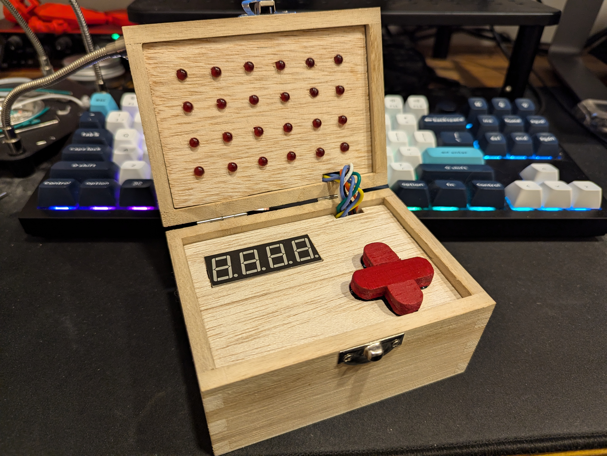
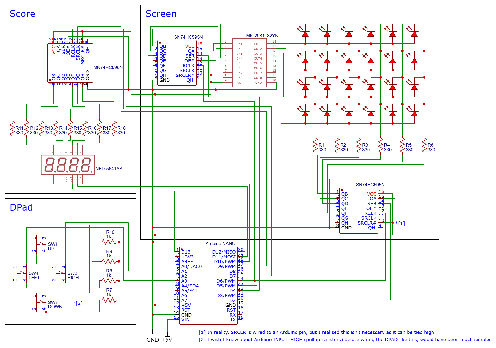

# Game Box

I turned a jewellery box into a handheld snake game with a mind blowing 6x4 resolution.

It was a fun little project to make something I could physically interact with, and learn a bit about electronics.

It's also my first time really dabbling in C++.

### Schematic
It's roughly this, probably some minor differences in terms pins used in the end etc.

